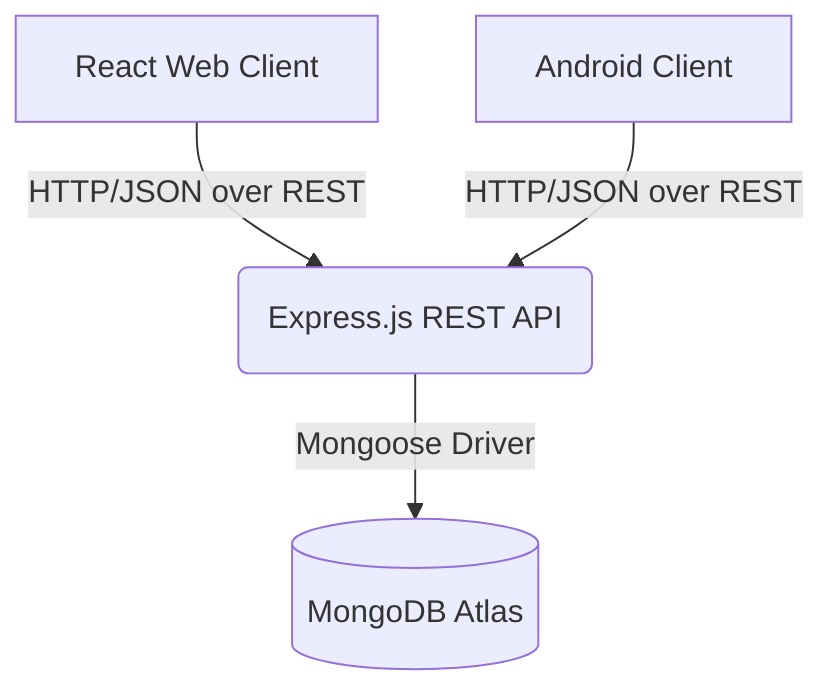

# Lab 4 — Full-Stack Client & Database Integration

## Architecture Overview



### Discussion: Why REST instead of Direct Database Access?
By placing a REST API between the clients (React/Android) and the database (MongoDB):
1. **Security**: We don't expose database credentials to the client application. The API acts as a secure gatekeeper.
2. **Coupling**: The clients only know about JSON and HTTP endpoints. If we ever swap MongoDB for PostgreSQL, the client code requires zero changes.
3. **Validation & Business Logic**: Centralized validation rules in the API mean we don't have to duplicate the same logic on web and mobile.

### Database Constraint
I applied a `unique: true` constraint on the `email` field in the Mongoose schema, along with an auto-incrementing `id` sequence. This ensures no two students can share the same email, preserving data integrity without relying solely on application-level checks.

## Setup Instructions

### 1. Backend (Express.js + MongoDB)
```bash
cd express-student-api
npm install
npm start
```
*Note: Make sure your `MONGODB_URI` in `.env` is correct and your IP is whitelisted in MongoDB Atlas Network Access (0.0.0.0/0 recommended for testing).*

### 2. React Web Client
```bash
cd student-client
npm install
npm run dev
```
The React app will run on `http://localhost:5173`. It connects to `http://localhost:3000` by default.

### 3. Android Client
A skeleton Android project structure is provided in `android-student-client/`. 
To run it:
1. Open Android Studio.
2. Create a new Empty Views Activity project.
3. Copy the Kotlin files (`MainActivity.kt`, `AddStudentActivity.kt`, `StudentApi.kt`) into `app/src/main/java/...`.
4. Copy the layout XML files into `app/src/main/res/layout`.
5. Add `implementation 'com.squareup.retrofit2:retrofit:2.9.0'` and `implementation 'com.squareup.retrofit2:converter-gson:2.9.0'` to `build.gradle`.
6. Sync and Run on an Emulator. The API base URL is hardcoded to `10.0.2.2:3000` for emulator access.

## Reflection (Web vs Mobile Clients)
Consuming the REST API is conceptually similar across both platforms: both perform HTTP requests and parse JSON into objects. What differs is the implementation detail: React uses `fetch` or `axios` with UI state management (hooks), while Android uses `Retrofit` with asynchronous callbacks and UI binding (Activities/XML). Error handling concepts map similarly (e.g. 400 maps to inline UI messages in React and Toast in Android).
